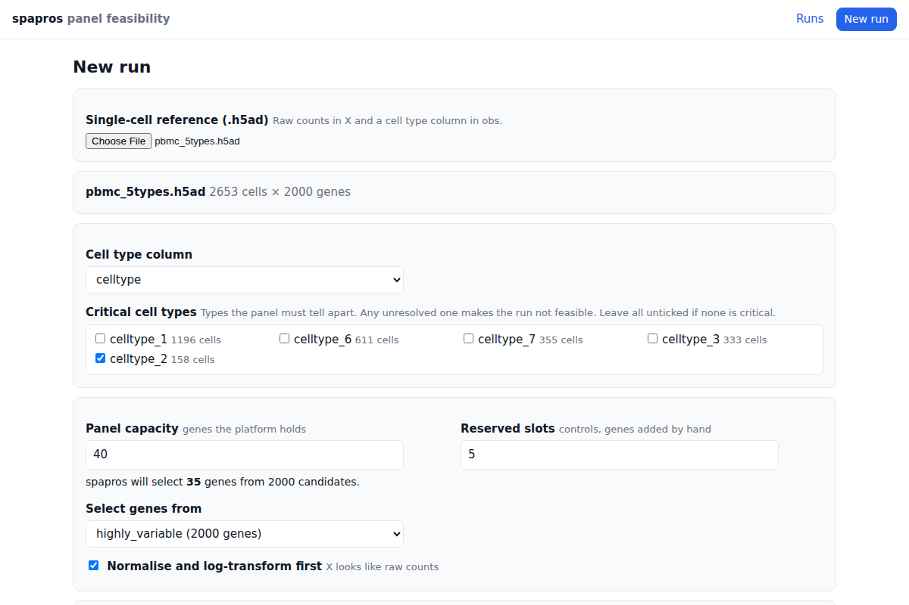

# spapros panel feasibility GUI


This fork of [spapros](https://github.com/theislab/spapros) adds a web GUI, meant to run on a VM, that selects a gene
panel for targeted spatial transcriptomics from a single-cell RNA-seq reference and ends every run with a report that
answers one question:

> With a panel of at most B genes, can we tell apart the cell types annotated in this reference, and is spapros' gene
> set a sound way to spend those slots?

You upload a dataset, choose the cell type annotation and the cell types that matter, set the panel size, and get back
one of four verdicts with the reasons behind it, plus the selected gene panel.



## Quick start

### On a VM with Docker

```bash
git clone https://github.com/alcrevenna/spapros.git && cd spapros
docker build -t spapros .
sudo mkdir -p /srv/spapros && sudo chown 1000 /srv/spapros   # the container runs as uid 1000
docker run -d --name spapros --restart unless-stopped \
    -p 8000:8000 -v /srv/spapros:/data \
    -e SPAPROS_SERVER_PASSWORD=change-me \
    spapros
```

Open `http://<vm-address>:8000` and sign in with the password (any user name). Uploads, results and reports are kept in
`/srv/spapros`, so they survive container restarts and image rebuilds.

### Without Docker

Python 3.11 to 3.13:

```bash
pip install "spapros[server] @ git+https://github.com/alcrevenna/spapros.git"
SPAPROS_SERVER_PASSWORD=change-me python -m spapros.server --host 0.0.0.0 --port 8000 --data-dir /srv/spapros
```

For a run on your own machine only, `python -m spapros.server` serves on `http://127.0.0.1:8000` with data in
`./spapros_server_data`.

## Preparing the input

The GUI takes an AnnData `.h5ad` file with:

-   **raw counts** in `X` (the GUI normalises and log-transforms them; untick that option if `X` is already
    log-normalised),
-   a **cell type column** in `obs`,
-   ideally a boolean `var["highly_variable"]` column to restrict the candidate genes (for example from
    `sc.pp.highly_variable_genes(adata, n_top_genes=8000, flavor="seurat_v3")`); otherwise spapros selects from all
    genes.

Cell types with fewer than 40 cells cannot be assessed by spapros' classifier. Merge or drop them before uploading, or
the run may come back INCONCLUSIVE.

## Running a panel selection

1. Click **New run** and choose the `.h5ad` file. After the upload, the GUI reads the file and shows its cells, genes
   and columns. A dataset you uploaded before can be picked again from **Or reuse an earlier upload**.
2. **Cell type column**: the annotation the panel has to recover. The GUI suggests a likely column.
3. **Critical cell types**: tick the types the panel must tell apart. Any critical type that ends up unresolved makes
   the run NOT FEASIBLE. Leave all unticked if none is critical. Types with too few cells are greyed out.
4. **Panel capacity** (default 300) is how many genes the platform holds, and **reserved slots** are genes you will add
   yourself (controls, housekeeping, genes of interest). spapros selects capacity minus reserved genes; the form shows
   that number and warns if the dataset has fewer candidate genes.
5. Optional: a **marker list CSV** (one column per cell type, genes as rows; see `data/small_data_marker_list.csv`)
   and **genes that must be on the panel**.
6. **Advanced settings**: quick or full evaluation (full adds clustering similarity), seed, CPUs, whether to compare
   with baseline gene sets and to compute the panel size curve, and every threshold of the verdict.
7. Click **Start run**. The run page shows the current stage (loading, selecting genes, baseline gene sets,
   evaluating, panel size curve, writing report) and the end of the log. You can close the browser; the run continues
   on the server.

The **Runs** page lists every run with its status and verdict. A run can be cancelled while it runs, retried after a
failure or cancellation (it resumes from its checkpoints), and deleted when finished. Runs take minutes for small
datasets and hours for large ones.

## Reading the report

When a run finishes, its page shows the verdict and the report. **Open report** shows it in its own tab and
**Download report** saves it as a single HTML file that opens offline and can be printed to PDF.

| Verdict                   | Meaning                                                                                              |
| ------------------------- | ---------------------------------------------------------------------------------------------------- |
| **FEASIBLE**              | The panel resolves the cell types that matter and fits the budget with headroom. Go ahead.           |
| **FEASIBLE WITH CAVEATS** | Workable, but some types are marginal or unresolved, or the budget is tight. Read the caveats first. |
| **NOT FEASIBLE**          | Critical cell types cannot be resolved at this panel size, or the required genes do not fit.         |
| **INCONCLUSIVE**          | The input cannot support a judgement (too few cells per type, too many types excluded).              |

The report contains:

-   the verdict with a one-line reason, the gene budget and the number of genes actually needed,
-   the failures and caveats behind the verdict,
-   a **cell type table**: cells, recall, class (resolved, marginal, unresolved, not assessed), the type it is most
    often confused with, and the best baseline's recall, worst first,
-   the **confusion matrix** of the selected panel,
-   the **panel size curve**: how many cell types are resolved with the top 25%, 50%, 75%, 100% (and 125%, 150%) of
    the ranked genes, which shows how many genes are really needed,
-   a **comparison with simple gene sets** (PCA, differential expression, highly variable and three random sets of the
    same size),
-   **secondary metrics** (neighbourhood and clustering recovery, gene redundancy, marker correlation),
-   the **gene panel** with each gene's rank and the cell types it marks, and the thresholds and options used.

The run page also offers `verdict.json` (the verdict and every number behind it), `probeset.csv` (spapros' full gene
ranking; selected genes have `selection = True`) and `evaluation_summary.csv`.

### How the verdict is decided

Recall is the share of a cell type's cells that spapros' classifier (XGBoost, 5-fold cross validation, 5 seeds)
assigns correctly using only the panel genes. A cell type is resolved at a recall of at least 0.80, marginal from 0.60
and unresolved below. With the default thresholds:

| Check                       | Feasible            | Caveat           | Not feasible                   |
| --------------------------- | ------------------- | ---------------- | ------------------------------ |
| Critical cell types         | all resolved        | any marginal     | any unresolved                 |
| Other cell types            | all resolved        | any not resolved |                                |
| Share of types resolved     | ≥ 90%               | 70–90%           | < 70%                          |
| Mean recall                 | ≥ 0.85              | 0.75–0.85        | < 0.75                         |
| Genes needed (size curve)   | ≤ 80% of the budget | above that       |                                |
| Comparison with random sets | better by ≥ 0.05    |                  | not better, and not a clear go |
| Required genes              | fit the budget      |                  | do not fit                     |

Secondary metrics and trailing the best baseline only add caveats. A run is INCONCLUSIVE when fewer than two cell types
can be assessed, more than 20% of types or 5% of cells are in types too small to assess, or a critical type cannot be
assessed. All thresholds can be changed per run under **Advanced settings**.

Classification on single-cell data is an upper bound for spatial data, where capture is lower and cell segmentation
adds errors. Expression fit to the platform's detection range and probe design are not checked.

## Server settings

| Setting                   | Flag         | Default                 | Meaning                                                         |
| ------------------------- | ------------ | ----------------------- | --------------------------------------------------------------- |
| `SPAPROS_SERVER_PASSWORD` |              | unset (no login)        | Password for every page (HTTP basic auth, any user name).       |
| `SPAPROS_SERVER_DATA_DIR` | `--data-dir` | `./spapros_server_data` | Where uploads, runs and reports are stored (`/data` in Docker). |
| `SPAPROS_SERVER_WORKERS`  | `--workers`  | 1                       | Runs that execute at the same time.                             |
|                           | `--host`     | `127.0.0.1`             | Address to listen on (`0.0.0.0` in Docker).                     |
|                           | `--port`     | 8000                    | Port.                                                           |

-   **Access**: without a password anyone who reaches the port can use the GUI. Set `SPAPROS_SERVER_PASSWORD`, or keep
    the port closed and use an SSH tunnel (`ssh -L 8000:localhost:8000 <vm>`). For HTTPS, put a reverse proxy such as
    Caddy or nginx in front; the GUI also works under a path prefix.
-   **Resources**: each run uses all CPUs by default, so one run at a time is the sensible setting. The spapros paper
    used 12 CPUs and 64 GB RAM; time and memory grow with the number of cell types (consider splitting data with more
    than about 100 types). No GPU is needed.
-   **Restarts**: runs interrupted by a server restart are queued again and resume from their checkpoints.
-   **API**: everything the GUI does is available over HTTP (`/uploads`, `/jobs`, `/jobs/{id}/report`, ...); see
    `http://<vm-address>:8000/docs`.

## Using spapros from Python

The GUI runs spapros' own selection (`sp.se.ProbesetSelector`) and evaluation (`sp.ev.ProbesetEvaluator`). To use
spapros directly, for example for expression constraints or probe design, see the
[spapros documentation](https://spapros.readthedocs.io/en/latest/), its [tutorials](https://spapros.readthedocs.io/en/latest/tutorials.html)
and the [paper](https://www.nature.com/articles/s41592-024-02496-z). The upstream project is
[theislab/spapros](https://github.com/theislab/spapros).

## How to cite

If you use Spapros in your research, please cite the following publication:
Kuemmerle, L. B., Luecken, M. D., et al. (2024). Probe set selection for targeted spatial transcriptomics. _Nature Methods_. https://doi.org/10.1038/s41592-024-02496-z

## Credits

This package was created with [cookietemple](https://cookietemple.com) using [Cookiecutter](https://github.com/audreyr/cookiecutter) based on [Hypermodern Python Cookiecutter](https://github.com/cjolowicz/cookiecutter-hypermodern-python).
